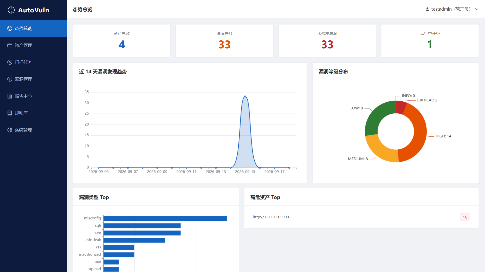
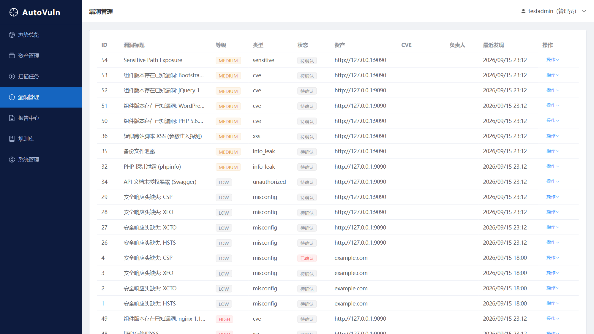
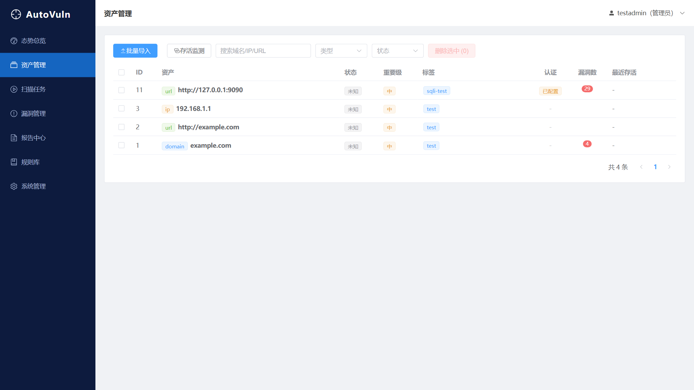
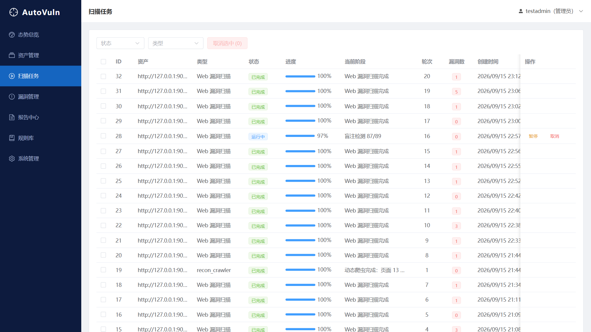

# AutoVuln · 自动化漏洞挖掘平台

> 七层流水线 · 可发布开源 · Docker 一键部署

AutoVuln 是一套**资产 → 信息收集 → 漏洞发现 → 验证 → 运营 → 分析输出 → 平台支撑**全链路自动化的漏洞管理平台。面向安全团队与个人研究者，支持多租户隔离、规则库在线更新、跨轮次对比、多格式报告。

> 📖 架构与设计细节见 [ARCHITECTURE.md](ARCHITECTURE.md)

> ⚠️ **合法使用声明**：本平台仅用于**获得明确授权的**安全测试与资产管理。使用者须对扫描目标拥有合法授权，因滥用造成的后果由使用者自行承担。

---

## 功能全景（对应需求规格 51 项）

### L1 资产管理层
| 功能 | 状态 | 说明 |
|---|---|---|
| 目标批量导入/去重 | ✅ P0 | 域名/IP/URL 批量录入，规范化自动去重合并 |
| 资产分组与标签 | ✅ P0 | 分组（项目/业务）+ 多标签 + 重要级 |
| 资产聚合 | ✅ P0 | 子域名/端口/指纹/接口/路径自动关联到资产主体 |
| 资产存活监测 | ✅ P1 | 一键批量探测，标记失效资产 |
| 资产变更追踪 | ✅ P2 | 基于审计日志的增删变更时间线 |

### L2 信息收集层
| 功能 | 状态 | 说明 |
|---|---|---|
| 子域名枚举 | ✅ P0 | crt.sh 证书日志（被动）+ 字典 DNS 爆破（主动）双通道 |
| 端口与服务识别 | ✅ P0 | 常用/全端口并发 TCP 探测 + Banner 抓取 |
| 指纹识别 | ✅ P0 | 头/标题/正文正则匹配，规则库可更新 |
| JS/API 接口提取 | ✅ P0 | 自动抓取 JS 文件提取接口/路径 |
| 目录/路径爆破 | ✅ P1 | 内置字典探测敏感路径，敏感文件自动告警 |
| 证书/旁站信息 | ⬜ P2 | 预留扩展位 |

### L3 漏洞发现层（核心引擎）
| 功能 | 状态 | 说明 |
|---|---|---|
| Web 漏洞扫描 | ✅ P0 | 规则驱动：注入/XSS/目录遍历/SSRF/未授权/信息泄露 |
| SQL 盲注检测 | ✅ P0 | 布尔盲注（真/假条件响应比对）+ 时间盲注（SLEEP 延迟检测） |
| OAST 带外检测 | ✅ P0 | 注入唯一 token 回调地址，目标主动请求回调即确认 SSRF/命令注入等无回显外带（默认本地回调，OAST_BASE_URL 可配公网） |
| 动态爬虫与渲染 | ✅ P0 | Playwright 无头 Chromium 渲染 SPA，提取 JS 动态链接 + XHR/fetch 接口 |
| 认证态扫描 | ✅ P0 | 资产配置登录 Cookie，扫描器统一注入所有请求，可爬取/探测登录后页面 |
| 命令注入/SSTI/XXE | ✅ P0 | 回显特征 + 时间延迟 + OAST 带外三通道；XXE 支持 file 实体回显与 http 实体外带 |
| 存储型 XSS | ✅ P0 | 表单提交 payload → 回读页面验证持久化回显 |
| 文件上传检测 | ✅ P0 | multipart 恶意文件 + 危险扩展名校验 + 上传后路径可访问性验证 |
| 指纹版本比对 | ✅ P0 | 响应头/页面提取组件版本 → 已知 CVE 版本区间匹配（内置 nginx/PHP/WordPress/jQuery/Bootstrap/Tomcat） |
| 渗透测试报告 | ✅ P0 | HTML 专业报告：执行摘要/风险评级/关键发现/漏洞证据链/方法论附录，支持 HTML/PDF/JSON/Excel |
| nuclei 规则兼容 | ✅ P0 | 导入 ProjectDiscovery nuclei YAML 模板（HTTP 类），word/status matcher 自动映射为平台规则 |
| 组件漏洞检测 | ✅ P0 | 指纹 → CVE 规则匹配（内置常见组件 CVE 规则，命中提示人工复核），漏洞库可更新 |
| 限速与目标保护 | ✅ P0 | 50ms 硬下限限速、并发控制、暂停/恢复/取消 |
| POC 检测引擎 | ✅ P1 | HTTP 结构化 POC；Python 型 POC 因沙箱逃逸 RCE 风险已禁用执行 |
| 主动+被动双模式 | ✅ P1 | 主动探测 + 规则化被动匹配框架 |
| 自定义插件接口 | ✅ P1 | 规则/POC JSON 导入即用，无需改代码 |
| 弱口令/未授权检测 | ✅ P1 | 内置常见弱口令 + 未授权路径探测 |

### L4 漏洞验证层
| 功能 | 状态 | 说明 |
|---|---|---|
| 误报过滤与去重 | ✅ P0 | 多签名命中 + vuln_key 幂等去重 |
| 证据留存 | ✅ P0 | 自动保存请求包/响应包/Payload |
| POC 执行复现 | ✅ P1 | POC 引擎二次确认 |
| 置信度标记 | ✅ P1 | 高/中/低三级 |
| 人工复核工作流 | ✅ P1 | 状态流转 + 操作留痕 |
| 误报反馈闭环 | ✅ P1 | 标记误报反哺规则库，≥3 次自动抑制规则 |

### L5 漏洞运营层（新增）
| 功能 | 状态 | 说明 |
|---|---|---|
| 漏洞状态机 | ✅ P0 | 发现→确认→修复中→已修复→复测通过，非法流转拦截，全程可追溯 |
| 跨扫描轮次对比 | ✅ P0 | 基于本轮发现快照，自动识别新增/已修复/复发 |
| 通知机制 | ✅ P1 | Webhook/邮件通道，高危触发，可配置 |
| 漏洞工单化 | ✅ P1 | 指派负责人 + 修复期限 |
| 修复超期提醒 | ⬜ P2 | 预留扩展位 |

### L6 分析与输出层
| 功能 | 状态 | 说明 |
|---|---|---|
| 危害定级 | ✅ P0 | CVSS 评分 + 五级定级 |
| 报告自动生成 | ✅ P0 | HTML / PDF / JSON / Excel 一键导出 |
| 漏洞库管理与检索 | ✅ P1 | 多维度筛选 + 关键词检索 |
| 影响面分析 | ✅ P1 | 高危资产 Top / 类型分布统计 |
| 态势统计 Dashboard | ✅ P1 | 趋势/等级/类型/高危资产可视化 |
| 修复建议匹配 | ✅ P1 | 按规则自动匹配修复建议 |
| 报告模板自定义 | ✅ P1 | 生成参数化，支持后续模板扩展 |
| 批量报告/对比报告 | ✅ P2 | 按资产范围批量出报告 + 轮次对比报告 |

### L7 平台支撑层（横切所有层）
| 功能 | 状态 | 说明 |
|---|---|---|
| 用户与权限管理 | ✅ P0 | 多用户、admin/user 角色 |
| 多租户数据隔离 | ✅ P0 | 全部查询硬性 user_id 边界，越权返回 404 |
| 规则库在线更新 | ✅ P0 | JSON 导入 + 远程 URL 拉取 |
| 任务调度与并发控制 | ✅ P0 | 线程池调度、并发上限、定时执行 |
| Docker 一键部署 | ✅ P0 | 单容器开箱即用 |
| 开放 API | ✅ P1 | 完整 REST API + Swagger 文档 |
| 操作审计日志 | ✅ P1 | 全操作留痕，可追溯 |
| 批量操作 | ✅ P1 | 批量确认/忽略/指派/取消 |
| 漏洞详情关联信息 | ✅ P1 | CVE 参考链接、复现 URL 直达、资产跳转 |
| 任务控制 | ✅ P1 | 取消/暂停/恢复、进度可视化 |
| 分布式扫描节点 | ⬜ P2 | 预留扩展位（架构已按可拆分设计） |
| 插件市场与沙箱 | ⬜ P2 | 预留扩展位（Python POC 沙箱因逃逸风险禁用，HTTP POC 可用） |

> ✅ = 已实现　🔶 = 以可插拔/框架化方式提供（未内置生产级深度能力）　⬜ = 预留扩展位

---

## 技术架构

```
┌─────────────────────────────────────────────────────┐
│                    Web 前端 (Vue3 + Element Plus)      │
└──────────────────────────┬──────────────────────────┘
                           │ REST /api（JWT）
┌──────────────────────────▼──────────────────────────┐
│               FastAPI 后端（多租户中间件）              │
│  ┌────────┐ ┌────────┐ ┌────────┐ ┌──────────────┐  │
│  │ 资产服务 │ │ 扫描API │ │ 漏洞运营 │ │ 报告/规则/审计 │  │
│  └────────┘ └───┬────┘ └────────┘ └──────────────┘  │
└──────────────────┼──────────────────────────────────┘
                   │
┌──────────────────▼──────────────────────────────────┐
│             扫描引擎（线程池 + 任务控制中心）            │
│  子域名 │ 端口 │ 指纹 │ JS/API │ 路径 │ Web │ CVE │ POC │
│  限速 · 暂停/恢复/取消 · 进度上报 · 证据留存             │
└──────────────────┬──────────────────────────────────┘
                   │
┌──────────────────▼──────────────────────────────────┐
│  SQLite（可切 MySQL） │ 文件存储（证据/报告/规则包）     │
└─────────────────────────────────────────────────────┘
```

**技术栈**：Python FastAPI · SQLAlchemy · Vue3 + Vite + Element Plus + ECharts · SQLite/MySQL · Docker

---

## 快速开始

### 方式一：Docker 一键部署（推荐）

```bash
# 多阶段构建：自动完成前端构建 + 后端打包，clone 仓库后即可直接构建
docker compose up -d --build
# 访问 http://localhost:8000
```

### 方式二：本地开发运行

```bash
# 1. 后端
cd backend
pip install -r requirements.txt
python -m uvicorn app.main:app --reload --port 8000

# 2. 前端（另开终端）
cd frontend
npm install
npm run dev        # http://localhost:5173（代理到 8000）
```

**首次使用**：注册的第一个账号自动成为管理员。注册需填写邀请码，默认 `autovuln2026`（生产环境务必通过环境变量 `INVITE_CODE` 修改）。

> ⚠️ 仓库内置演示账号 `testadmin / test123456`（管理员）仅用于本地开发环境，**生产/公网部署前必须删除或修改**。内置漏洞靶场 `demo_vuln_app.py` 包含 20 个故意构造的漏洞端点，**仅限本地或明确授权的测试环境运行**，严禁部署到公网。

**配置方式**：复制 `.env.example` 为 `.env`（项目根目录或 `backend/` 下均可），启动时自动加载。常用项：`SECRET_KEY`（生产必设，留空自动生成并持久化到 `backend/data/secret.key`）、`INVITE_CODE`、`CORS_ORIGINS`、`WEBHOOK_URL`。

### 端到端验证

```bash
cd backend
python tests/e2e_smoke.py    # 20 项闭环测试：注册→资产→扫描→漏洞→轮次对比→报告→租户隔离
```

---

## 界面预览



> 态势总览：资产/漏洞统计、14 天发现趋势、等级分布、类型 Top、高危资产 Top



> 漏洞管理：漏洞列表（等级/类型/状态/CVE/证据）、人工复核与状态流转



> 资产管理：目标批量导入、标签分组、认证 Cookie 配置、存活监测



> 扫描任务：任务控制（暂停/恢复/取消）、进度可视化、多轮次

更多界面见 `docs/screenshots/`（登录页 / 报告中心）。

---

## 使用流程

1. **录入资产** → 资产管理页批量导入目标（域名/IP/URL），自动去重、打标签
2. **发起扫描** → 资产详情页选择"全流程扫描"或单类扫描，设置限速间隔
3. **查看漏洞** → 漏洞管理页筛选/检索，查看请求响应证据，人工复核
4. **运营闭环** → 确认 → 指派 → 修复 → 复测，状态全程留痕
5. **轮次对比** → 二次扫描后对比历史轮次，识别新增/已修复/复发
6. **导出报告** → HTML/PDF/JSON/Excel 一键生成下载

---

## 开发红线落实

| 需求约束 | 实现 |
|---|---|
| 扫描可限速/可暂停/可恢复 | 任务控制中心 + 基类 checkpoint；限速硬下限 50ms |
| 数据必须按租户隔离 | 所有查询强制 `user_id` 过滤；越权统一 404 |
| 规则库必须可更新 | 漏洞规则/指纹/POC 均存库，支持 JSON 导入 + 远程拉取 |
| 全链路可审计 | 登录/资产/扫描/流转/报告全操作落审计日志 |
| 平台自身安全 | JWT 鉴权、PBKDF2 密码、API 全鉴权、邀请码必填、CORS 白名单、出站 URL SSRF 防护、Python POC 沙箱禁用 |

---

## API 概览（Swagger: `/api/docs`）

| 模块 | 端点 | 说明 |
|---|---|---|
| 认证 | `POST /api/auth/register` `POST /api/auth/login` `GET /api/auth/me` | 注册/登录/当前用户 |
| 资产 | `POST /api/assets/import` `GET /api/assets` `GET /api/assets/{id}/records` `POST /api/assets/alive-check` | 导入/列表/聚合/存活 |
| 扫描 | `POST /api/scans` `GET /api/scans` `POST /api/scans/{id}/pause\|resume\|cancel` `GET /api/scans/rounds/{asset_id}` | 创建/控制/轮次 |
| 漏洞 | `GET /api/vulns` `POST /api/vulns/{id}/transition` `POST /api/vulns/batch/action` `POST /api/vulns/round-compare` `POST /api/vulns/{id}/false-positive-feedback` | 列表/流转/批量/对比/误报反馈 |
| 报告 | `POST /api/reports/generate` `GET /api/reports/{id}/download` | 生成/下载 |
| 规则 | `GET\|POST /api/rules/web\|fingerprint\|poc` `POST /api/rules/import` `POST /api/rules/sync-remote` | 规则管理/导入/在线更新 |
| 平台 | `GET /api/dashboard` `GET /api/audit-logs` `GET /api/admin/users` `GET /api/notify-config` | 态势/审计/用户/通知 |

---

## 项目结构

```
├── backend/
│   ├── app/
│   │   ├── main.py            # FastAPI 入口（SPA 托管，/api 路由优先）
│   │   ├── config.py          # 环境变量 + .env 配置（密钥持久化/邀请码/CORS）
│   │   ├── database.py        # SQLAlchemy 会话
│   │   ├── models/            # 用户/资产/扫描/漏洞/规则/审计 模型
│   │   ├── schemas/           # Pydantic 请求响应模型
│   │   ├── core/              # JWT·密码·多租户·审计
│   │   ├── scanners/          # 扫描引擎：子域名/端口/指纹/JS/路径/Web/CVE/POC + 调度器
│   │   ├── services/          # 资产/漏洞状态机/轮次对比/通知/报告/态势/种子规则
│   │   └── api/               # REST 路由
│   ├── tests/e2e_smoke.py     # 端到端闭环测试
│   └── requirements.txt
├── frontend/                  # Vue3 + Element Plus 管理后台
│   └── src/views/             # 登录/总览/资产/扫描/漏洞/报告/规则/系统管理
├── Dockerfile
├── docker-compose.yml
└── .env.example
```

---

## 里程碑对照

| 里程碑 | 状态 |
|---|---|
| **M1（P0 集）** 资产→扫描→验证→报告闭环 | ✅ 已完成并通过 20 项端到端测试 |
| **M2（P1 集）** POC/插件/人工复核/通知/工单/Dashboard/API/审计 | ✅ 已完成（含弱口令检测） |
| **M3（P2 集）** 分布式节点/插件市场/对比报告 | 🔶 部分完成（轮次对比报告已实现；分布式节点/插件市场预留） |

---

## 许可

MIT License。用于合法授权的安全测试场景。
